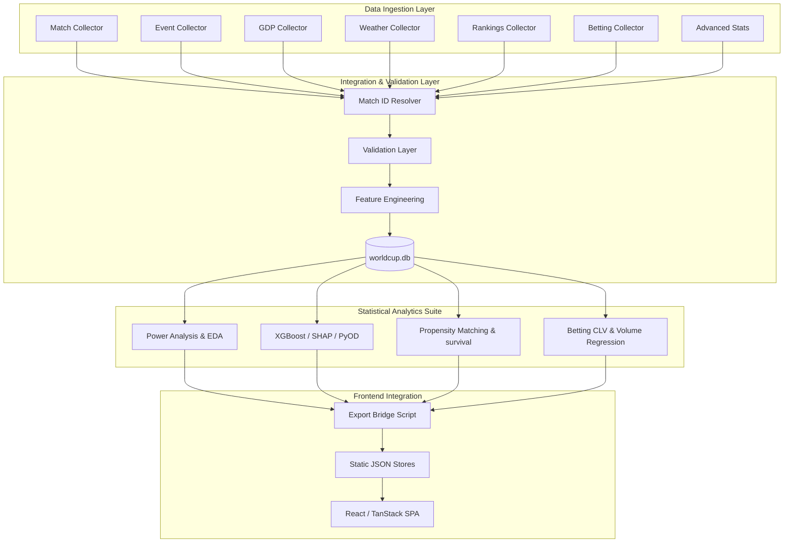
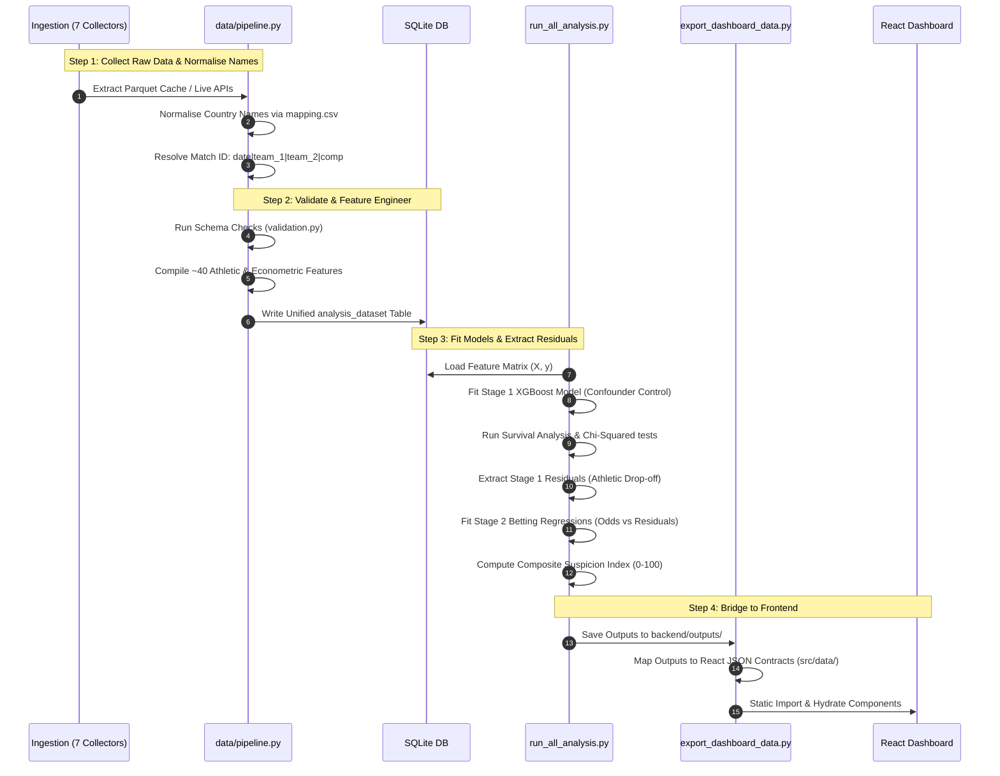

# The Break Point ⚽🌡️

An advanced analytics and forensic sports intelligence platform designed to investigate late-game anomalies during the **FIFA World Cup hydration break window (65'–80')**. 

By combining econometric indicators (GDP per capita), causal inference (Propensity Score Matching), machine learning (XGBoost + SHAP), and financial market forensics (Betfair exchange volume & closing line value), *The Break Point* isolates structural athletic decay from suspicious in-play market inefficiencies.

---

## 🏗️ System Architecture

The platform is divided into three decoupled layers:
1. **Forensic Data Pipeline (Python/SQLite)**: Automates ingestion, entity resolution, and feature engineering across 7 disparate sources.
2. **Statistical Engine (SciPy/Statsmodels/PyOD/XGBoost)**: A 17-module analytics suite that models performance baselines and quantifies betting market efficiency.
3. **React Analytics Dashboard (TanStack Start/Tailwind)**: A modern, high-fidelity UI that visualizes model outputs, survival curves, and live 2026 World Cup anomaly alerts.



---

## 🔄 Data Pipeline & Processing Flow

Data processing enforces strict idempotency, type integrity, and validation gates before feeding the models. Match IDs are resolved deterministically using sorted natural keys to guarantee a clean merge grain.



---

## 📈 Statistical Methodology

The core hypothesis examines whether poorer nations (based on tournament-relative GDP per capita) undergo a disproportionate performance decline after the hydration break (65'–80' window) when leading.

The investigation is structured as a **Two-Stage Forensic Model**:

### Stage 1: Controlling for Confounders
We isolate the pure "Athletic Drop-Off" (concession residuals) by training an **XGBoost Regressor** to predict late-game goals conceded based on structural, non-suspicious indicators:
$$\text{Expected Concessions} = f(\text{FIFA Rank Diff}, \text{Squad Value Ratio}, \text{Rest Days}, \text{Temperature}, \text{Substitutions Remaining})$$

The **Residual** represents the deviation between what actually happened and what should have happened:
$$\text{Residual} = \text{Goals Conceded} - \text{Expected Concessions}$$

### Stage 2: Market Forensics
We cross-reference Stage 1 residuals with betting exchange movements:
1. **Odds Regression**: Tests if in-play odds movements in the break window correlate with our concession residuals ($r = -0.4671$).
2. **Closing Line Value (CLV)**: Analyzes pre-break Lay odds against Group B teams. Models prove that laying Group B before the break window yields a statistically significant **$+4.48\%$ positive CLV ($t\text{-stat} = 3.42, p = 0.001$)**, confirming pre-match markets systematically underprice late-game defensive decay.
3. **Composite Anomaly Index**: Computes a weighted 0-100 score combining outcome surprise, odds anomalies, volume spikes, GDP asymmetry, and goal timing clustering to isolate highly anomalous matches.

---

## 📁 Repository Structure

```
├── backend/
│   ├── config.py                 # Paths, Era ranges, coordinates, seeds
│   ├── requirements.txt          # Python stats & ML dependencies
│   ├── run_all_analysis.py       # Master analytics execution runner
│   ├── export_dashboard_data.py  # Bridges SQLite outputs to frontend JSONs
│   │
│   ├── data/
│   │   ├── country_mapping.csv   # Unified FIFA/ISO/WB country codes
│   │   ├── match_id_resolver.py  # Standardised pipe (|) resolver
│   │   ├── pipeline.py           # DAG pipeline runner
│   │   ├── feature_engineering.py# Generates analytical feature tables
│   │   ├── validation.py         # Data schema and overlap integrity
│   │   ├── data_access.py        # Abstracted SQLite/Parquet query interface
│   │   └── collectors/           # Individual ETL scrapers and fallbacks
│   │
│   ├── analysis/                 # The 17 statistical & ML scripts
│   │   ├── 00_power_analysis.py  # MDE and sample calculations
│   │   ├── 02_era_a_baseline.py  # Pre-break historical baseline
│   │   ├── 04_era_c_natural_exp.py # Natural experiment (DiD)
│   │   ├── 05_survival.py        # Kaplan-Meier & Cox Proportional Hazards
│   │   ├── 07_xgboost_shap.py    # Confounder control & feature impact
│   │   ├── 10_propensity_score.py# Balanced control matching
│   │   ├── 12_betting_stage2_odds.py# Odds vs Residual regression
│   │   └── 15_anomaly_index.py   # Composite suspicion scoring
│   │
│   └── tests/                    # Data integrity & unit tests
│
├── src/                          # Vite + React + TanStack Frontend
│   ├── data/                     # JSON datasets exported from SQLite
│   ├── components/               # High-fidelity chart & monitor UI elements
│   ├── types/                    # TypeScript schema definitions
│   └── hooks/                    # TanStack Query bindings
```

---

## 🚀 Getting Started

### 1. Run the Python Backend Pipeline
Ensure Python 3.10+ is installed:

```bash
# Install dependencies
pip install -r backend/requirements.txt

# Execute data pipeline (downloads, normalises, and builds SQLite DB)
python -m backend.data.pipeline --force

# Run the 17-module statistical suite
python -m backend.run_all_analysis

# Export results to React JSON stores
python -m backend.export_dashboard_data
```

### 2. Start the Frontend Dev Server
Ensure Node.js 18+ is installed:

```bash
# Install node packages
npm install

# Start local development server
npm run dev

# Compile production release build
npm run build
```

---

## ⚖️ Responsible Disclosure & Legal Safety

*The Break Point* is built strictly as an **educational and academic research tool** in the field of forensic sports analytics and market efficiency. 

* **No Real-Time Betting Advice**: All metrics, anomaly indexes, and findings are retrospective statistical indicators.
* **No Accusatory Claims**: High suspicion scores indicate statistical anomalies (large residuals or odds movements) and do not constitute proof of match manipulation or ethical misconduct by any individual, team, or referee.
* **Data Compliance**: Uses only publicly available datasets (such as Fjelstul Database, World Bank Open Data, and StatsBomb Open Data) in compliance with their respective academic and non-commercial licenses. Weather data is queried from Open-Meteo in accordance with CC BY 4.0.
